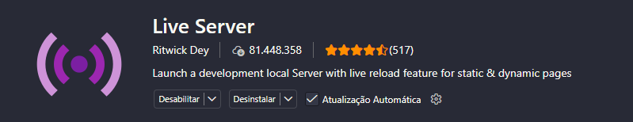

# Artigo de curiosidade

É uma página web responsiva hospedada no site fictício chamado **Curiosidades de Tecnologia**. O artigo fala sobre o **Bugdroid** (mascote do Android), explicando a sua história e curiosidades sobre ele.

### Tecnologias utilizadas

- HTML
- CSS

## O que aprendi nesse projeto?

Esse foi o meu primeiro projeto que desenvolvi quando estava no início dos meus estudos de programação. Nele, eu coloquei em prática o que aprendi sobre:
- Manipulação de imagens;
- Responsividade com media queries;
- Estrutura HTML e tags semântica e não semântica;
- Estilização, gradientes e transições simples com CSS;
- Incorporar vídeos na página e adaptá-lo para outros dispositivos;
- UI/UX design básico.

## 🖥️ Como rodar o projeto na sua máquina

### Pré-requisitos

- Tenha uma IDE instalada.
  - Recomendo **VS Code** por ser leve e simples.

#### Passo a passo

1. No repositório do projeto, clique em **Code**.
2. Clique em **Download ZIP**. Faça o download no seu desktop.
3. Após o download, extraia o arquivo ZIP.
4. Clique com botão direito na pasta extraída.
5. Clique em **Abrir com o Code**.
6. Clique em extensões.
7. Procure por essa extensão:



Em seguida, clique em instalar.

> Explicação: Essa extensão fará rodar o projeto no seu navegador localmente.

8. Após a instalação, feche a página da **Extensão**.
9. Clique em **Explorador** para voltar.
10. No canto inferior direito, clique em **Go Live**. O projeto abrirá automaticamente no seu navegador.

Para interromper o servidor, clique em `Port: ...` (no mesmo lugar onde você clicou para rodar o projeto).

### Em outros dispositivos

Para acessar em outros dispositivos, é preciso que eles estejam conectados à **mesma rede local** que está sendo usado pela máquina.

1. Com o projeto rodando, observe o número da porta na URL. Por exemplo:

```
http://127.0.0.1:5500/
```

Nesse exemplo, a porta é `5500`.

`127.0.0.1` é o **endereço do localhost** e só pode ser acessado pela própria máquina.

2. Abra o terminal no seu computador e digite:

```
ipconfig
```

Procure por algo como:

```
Endereço IPv4 . . . . . . . . . . : IP_do_endereço
```

O `IP_do_endereço` é o endereço local do seu computador na rede, você irá usá-lo para acessar o projeto em outro dispositivo.

2. No outro dispositivo, abra o navegador, digite o IP local junto com a porta na barra de endereço e acesse o projeto.

```
SEU_IP_LOCAL:n°_porta
```
